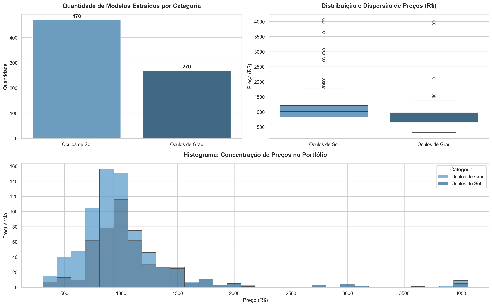

# 🕶️ Ray-Ban Data Scraper ||

## Sobre

Este script automatiza a extração do catálogo de produtos da [Ray-Ban Brasil](https://www.ray-ban.com/brazil).
Coletando informações detalhadas como **modelos, cores disponíveis e preços**, o projeto transformas esses sites dinâmicos em bases de dados estruturadas (CSV/XLSX).
Esses dados são ideais para alimentar dashboards de Business Intelligence (Power Bi/Metabase/Looker Studio), facilitando análises de precificação, tendências comerciais e estudos de competitividade.

## Demonstração

*Acima: Selenium navegando e contornando o carregamento dinâmico e o BeautifulSoup estruturando os dados para o Pandas.*

## 📂 Arquitetura do Projeto
- `ray_ban_scrapper.py`: Script responsável pelo crawler, extração HTML e salvamento inicial dos dados no formato `.csv`.
- `ray_ban_matplot.py`: Script de inteligência que consome a base gerada, higieniza as strings financeiras e plota os gráficos.
- `rayban_todos_oculos.csv`: Base de dados tabular (output do scrapper).
- `dashboard_rayban.png/jpg`: Imagem gerada automaticamente contendo a análise do portfólio.

## 🛠️ Tecnologias Utilizadas
- **Linguagem:** Python 3.x
- **Web Scraping:** `selenium`, `undetected-chromedriver`, `beautifulsoup4`
- **Análise e Visualização:** `pandas`, `matplotlib`, `seaborn`
